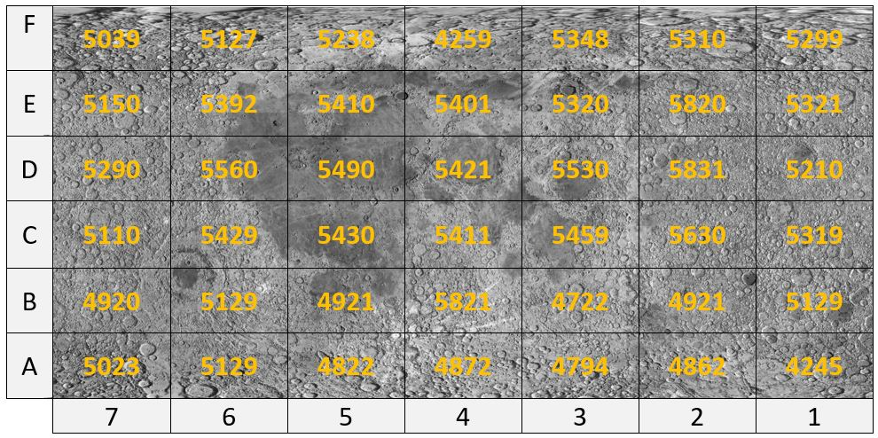

# Peak/Valley Finder

## Background

The table below represents the data from a topographical elevation map of the surface of the moon. The grid shows the six points along the side and seven points along the bottom. The peaks have been highlighted in yellow (B4,D2,D6) and valleys have been highlighted in green (B3,C4,E3):

## Directions
Write a program that reads the data for the map from a text file named either map1.txt or map2.txt (entered by the user) into a 2D array. The program will process the array to locate all peaks from the elevation data and print them to the screen as shown below. Once the program successfully is finding peaks, have the program do the same processing to find the valleys and print them to the screen.

To find the peaks in the data, we compare a potential peak with its four neighboring points. If all four neighboring points are less than the potential peak, then the potential peak is a real peak. 

Similarly, to find the valleys we compare a potential valley with its four neighboring points. If all four neighboring points are greater than the potential valley, then the potential valley is a real valley. 

<b>Note: The points on the outer edges of the array (map) cannot be checked as potential peaks or valleys because we do not have elevation information on all four sides of the points.

Your program should implement the methods explained above to find all of the peaks and valleys. The output of the program should use the row and column notation shown in the elevation map and be printed in the correct alpha numeric order. For example, B2 prints before B4 and C3 prints before D3.</b>

## Interface Prototype Example

### Test Case 1 Output
<pre><b>Enter the map file to read: ./map1.txt

Peak 1 is at coordinate B4
Peak 2 is at coordinate D2
Peak 3 is at coordinate D6

Valley 1 is at coordinate B3
Valley 2 is at coordinate C4
Valley 3 is at coordinate E3</b></pre>
### Test Case 2 Output
<pre><b>Enter the map file to read: ./map2.txt

Peak 1 is at coordinate C2
Peak 2 is at coordinate C4
Peak 3 is at coordinate D5
Peak 4 is at coordinate E2

Valley 1 is at coordinate B2
Valley 2 is at coordinate E6</b></pre>

